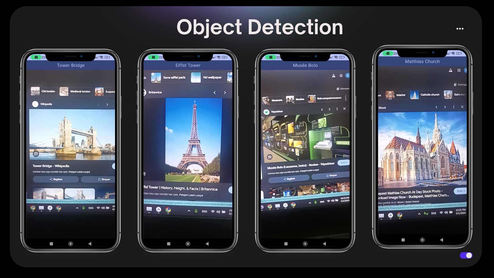

# DetertorLandMark
Aplikasi ini dirancang untuk melakukan riset mengenai hasil deteksi objek secara live dengan menggunakan model machine learning Klasifikasi Gambar. Model yang telah dikonversi ke format TFlite dapat ditemukan di folder app -> src -> main -> assets -> landmark.tflite.

## Cara Clone
1. Clone repository ini ke lokal dengan menggunakan perintah "git clone https://github.com/rafikaWardah12/DetectorLandMark.git" 
2. Pastikan file landmark.tflite sudah ada di folder assets
3. Kemudian, build dan jalankan proyek menggunakan Android Studio

## Preview 

     

